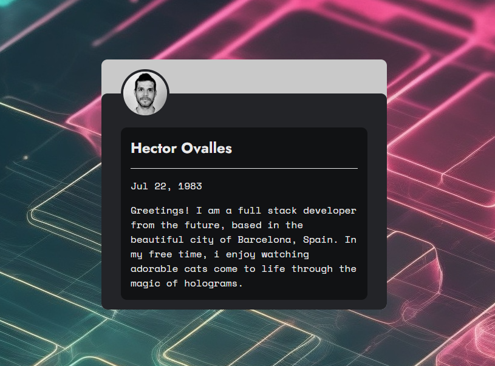

# F5P7M - Introduction, code baby steps

## Table of contents

- [Overview](#overview)
  - [The challenge](#the-challenge)
- [My process](#my-process)
  - [Built with](#built-with)
  - [What I learned](#what-i-learned)
- [TODO](#todo)
- [Author](#author)

## Overview

### The challenge

First solo project. Getting to know HTML and CSS

- Introduce yourself using code, we will need a photo, title and a paragraph

### Links

- Live Site URL: [Live site](https://devctor.github.io/F5P7-introduction-PP/)

## My process

Simple development environment usin:
    - VSCode
    - Live-server vscode plugin

### Built with

- Semantic HTML5 markup
- Flexbox
- Mobile-first workflow

### What I learned

With this particular project i learn to set a minimal development environment and to use semantic HTML and CSS.

### TODO
- Use [Playwright](https://playwright.dev/) - For reliable end-to-end testing

## Author
- Hector Ovalles
